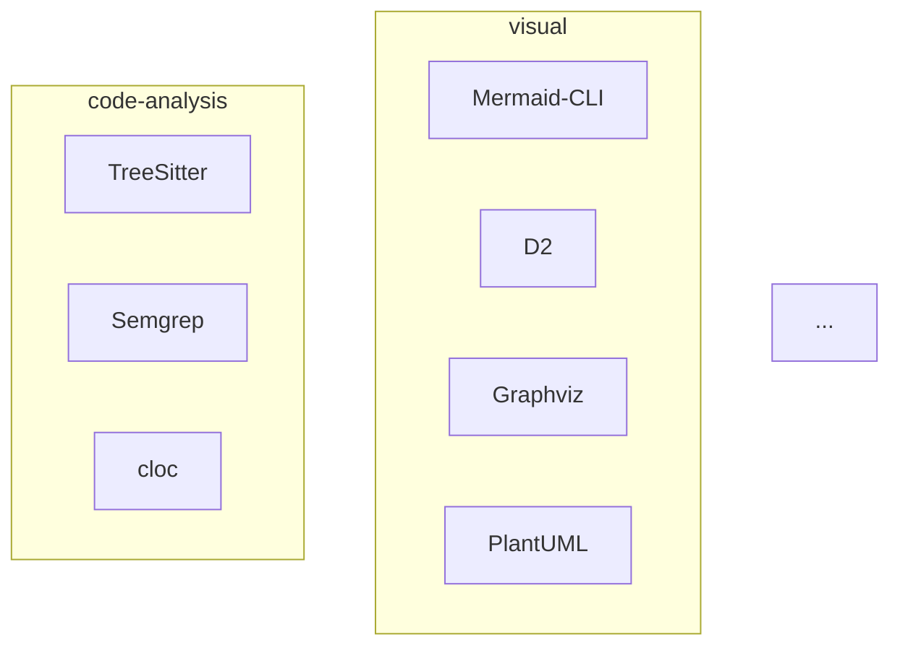

# /ias-heatmap

Generuje wizualizację mapy ciepła ekosystemu narzędzi IAS.

## Użycie

```bash
# Tabela ASCII (domyślnie)
python scripts/heatmap.py

# Diagram Mermaid
python scripts/heatmap.py --mermaid

# Wyjście JSON
python scripts/heatmap.py --json

# Zapis do pliku
python scripts/heatmap.py --output report.md

# Tylko detekcja konfliktów portów
python scripts/heatmap.py --check-ports
```

## Argumenty

| Argument        | Opis                             | Domyślna |
| --------------- | -------------------------------- | -------- |
| `--mermaid`     | Wyjście jako diagram Mermaid     | false    |
| `--json`        | Wyjście jako JSON                | false    |
| `--output`      | Zapisz do pliku                  | stdout   |
| `--check-ports` | Tylko detekcja konfliktów portów | false    |

## Output

### ASCII Table (domyślnie)

```
=== Kwatermistrz Heat Map ===

Pokrycie domen:
  ai            ███          1 narzędzie (hot: 1) ⚠️ GAP
  code-analysis █████████    3 narzędzia (hot: 3)
  data          ████████████ 4 narzędzia (hot: 4)
  dev           ████████████ 4 narzędzia (hot: 4)
  devops        ███          1 narzędzie (hot: 1) ⚠️ GAP
  visual        ████████████ 4 narzędzia (hot: 3, warm: 1)

Mocne strony:
  ✅ visual: 4 narzędzia, 3 hot
  ✅ data: 4 narzędzia, 4 hot

Słabe strony:
  ❌ devops: tylko 1 narzędzie (actionlint)
  ❌ ai: tylko 1 narzędzie (PromptLab)

Podsumowanie:
  Pokrycie domen: 66.67%
  Nakładanie się: 23.53%
  Priorytety: hot=16, warm=1, cold=0
```

### Mermaid Diagram



### JSON

```json
{
  "timestamp": "...",
  "domains": {...},
  "overlaps": [...],
  "port_conflicts": [...],
  "strengths": [...],
  "weaknesses": [...],
  "bottlenecks": [...],
  "coverage_score": 0.67,
  "overlap_score": 0.24
}
```

## Workflow

1. Wczytaj `data/tool_registry.json`
2. Wczytaj `.envy` (opcjonalnie)
3. Analiza domen → pokrycie, luki
4. Wykrywanie nakładania → grupowanie po alternatywach
5. Konflikty portów → parsowanie run_command
6. Mocne/słabe strony → identyfikacja
7. Generowanie wyjścia → ASCII/Mermaid/JSON

## Przykłady

```bash
# Pokaż mapę ciepła
/ias-heatmap

# Generuj Mermaid do wklejenia w dokumentację
/ias-heatmap --mermaid

# Eksportuj JSON do dalszego przetwarzania
/ias-heatmap --json --output heatmap.json

# Sprawdź tylko konflikty portów
/ias-heatmap --check-ports
```
